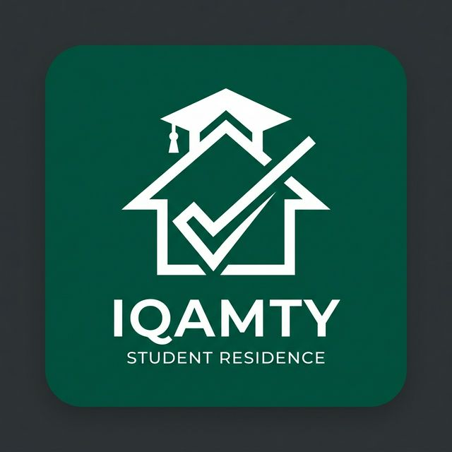
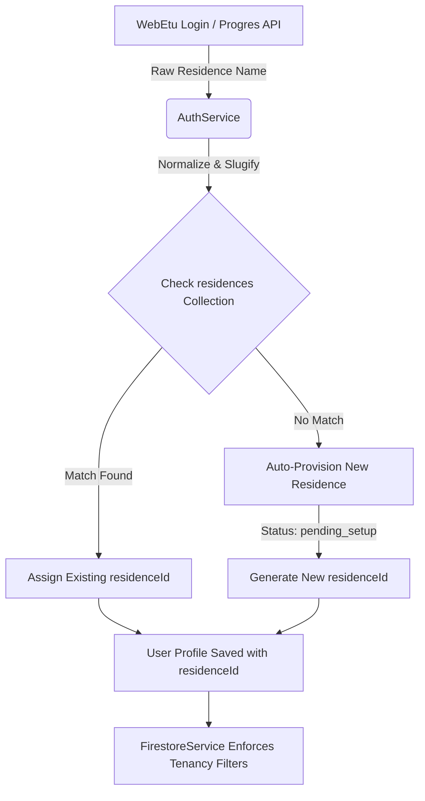

  

  # 🏢 Iqamty (إقامتي) : The Smart Campus Platform
  
  **Final Project Report & Architectural Overview**

  
  
  
  

---

## 📖 Executive Summary

**Iqamty** is a high-performance, proprietary mobile and web platform designed to revolutionize and digitize the Algerian university residence experience. Conceived as a centralized operating system for campus living, it seamlessly bridges the gap between **Students**, **Administrators**, and **Maintenance Workers**.

By integrating directly with the official **Progres (WebEtu) API** for identity verification, Iqamty completely eliminates manual onboarding. It employs a dynamic, multi-tenant cloud architecture to isolate data, announcements, and logistics by physical campus, ensuring a secure and localized experience for every user.

---

## 🎯 The Problem & Our Solution

**The Challenge:** Traditional university residences rely on fragmented, paper-based systems for meal ticketing, maintenance requests, and administrative announcements. This leads to inefficiencies, lost requests, and a disconnect between campus management and students.

**The Solution:** Iqamty introduces a fully digital ecosystem. 
* **For Students:** A single app to book meals, report broken plumbing, view bus schedules, and chat with administration.
* **For Administration:** A real-time, unified dashboard to monitor campus operations, approve meal plans, and dispatch technical teams.
* **For Workers:** A streamlined ticketing system to track daily repair assignments across campus blocks.

---

## ✨ Core Modules & Capabilities

The platform dynamically morphs its UI and capabilities based on the authenticated user's role:

### 🎓 1. Student Portal
* **Dashboard & Live Status:** Real-time visibility into whether the campus restaurant or administrative offices are open or closed.
* **Smart Dining Booking:** A 3-day rolling reservation system for Breakfast, Lunch, and Dinner. Features capacity limits and meal ratings.
* **Technical Service Pipeline:** Submit maintenance tickets for room issues (Plumbing, Electrical, Carpentry) with attached images, and track their real-time resolution status.
* **Transport & Logistics:** View live schedules and maps for university shuttle buses (Navettes).
* **Community Forum:** A localized social feed for students of the same campus to share resources and discussions.
* **Direct Administration Chat:** Secure, 1-on-1 messaging with campus management.

### 🛡️ 2. Administrator Control Panel
* **Tenancy Management:** Manage all aspects of a specific campus without seeing cross-contamination from other universities.
* **Dining Configuration Engine:** Visually build weekly menus, set meal capacities, and instantly toggle kitchen status (Open/Closed).
* **Ticketing & Dispatch:** Review incoming student maintenance requests and dispatch them to specific technical workers.
* **Announcement Broadcaster:** Push high-priority, pinned alerts directly to the student dashboard.
* **Document Center:** Upload official PDFs, forms, and rulebooks for mass student download.

### 🛠️ 3. Worker Dashboard
* **Task Queue:** Receive dispatched maintenance tickets detailing the exact room number, issue category, and student notes.
* **Live Status Updates:** Move tickets through the lifecycle (`Pending` ➔ `In Progress` ➔ `Resolved`).

---

## 🏗️ System Architecture & Multi-Tenancy

Iqamty is built on a "Zero-Admin Friction" tenant model. Campuses are not manually created; they are **auto-provisioned** the moment the first student from that physical location logs in.

### The `idresidence` Isolation Engine

To optimize cloud read costs while maintaining strict data silos, Iqamty uses a **Hybrid Stream-Filtering Architecture**. The cloud database performs the initial broad query, while the client layer applies real-time tenant mapping before it reaches the UI.

---

## 🗄️ Database Schema

The application relies on a NoSQL document structure optimized for real-time streams:

* **`users`:** Stores profile data, hashed passwords for offline fallback, role definitions, and `residenceId` bindings.
* **`residences`:** The tenant documents containing configuration flags (e.g., `isRestaurantOpen`, `status`).
* **`restaurant` & `meals`:** Stores rolling 3-day configurations and historical meal reservation arrays.
* **`requests`:** The lifecycle tracking documents for technical repair tickets.
* **`announcements`:** Global and residence-specific broadcast messages.

---

## 💻 Technology Stack

| Domain | Technology | Purpose |
| :--- | :--- | :--- |
| **Frontend Framework** | Flutter (Dart) | Single high-performance codebase for Android, iOS, and Web. |
| **State Management** | Provider | Reactive UI updates and dependency injection. |
| **Navigation** | GoRouter | Declarative, URL-based routing with redirection guards. |
| **Authentication** | Firebase Auth | Anonymous bridging to secure WebEtu API logins. |
| **Database** | Cloud Firestore | Real-time, NoSQL document syncing. |
| **Media Storage** | Cloudinary & Firebase | Optimized image uploading and CDN delivery. |
| **Local Storage** | SharedPreferences | JWT caching for offline capabilities. |

---

## 🎨 UI/UX Philosophy
Iqamty utilizes a premium, custom design system built entirely from scratch. Instead of relying purely on Material defaults, it implements:
* **Glassmorphism:** Soft, blurred transparency effects for modal sheets and floating elements.
* **Modern Typography:** Utilizing the `GoogleFonts.inter()` family for high legibility and a sleek aesthetic.
* **Micro-Animations:** Powered by `flutter_animate` to ensure every screen transition, button press, and data load feels dynamic, responsive, and alive.

---

  <b>Built to elevate the student living experience.</b> 
  All rights reserved. Proprietary software.

